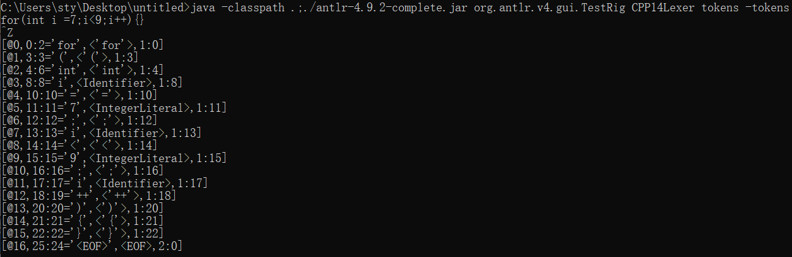
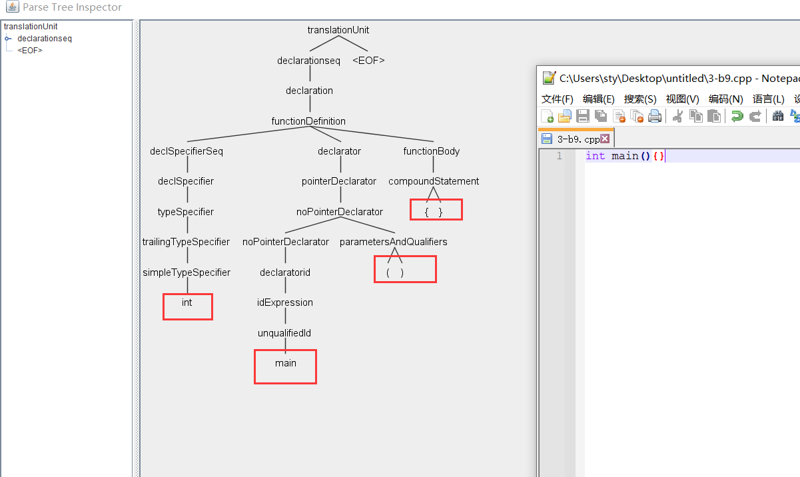

ANTLR学习

参考链接：

https://blog.csdn.net/theVicTory/article/details/116607755

https://segmentfault.com/q/1010000000373381

命令示例

grun.bat CPP14 translationUnit -gui 3-b9.cpp

grun.bat CPP14Lexer tokens -tokens 3-b9.cpp

grun.bat CPP14 translationUnit -tree 3-b9.cpp > out.txt

